# 🎮 Gameloger: Mi Perfil Gamer – Aplicación Laravel

*Gameloger* es una aplicación web para registrar, visualizar y gestionar tu colección de videojuegos. Esta versión representa una reconstrucción completa del layout, la navegación y el estilo, incorporando una estética moderna inspirada en interfaces manga/anime.

Desarrollada en *Laravel*, permite a los usuarios gestionar tanto su perfil personal como su biblioteca de videojuegos, combinando un backend robusto con una interfaz oscura, estilizada y altamente visual, diseñada para ofrecer una experiencia fluida, atractiva y totalmente personalizada.

---

## ✨ Características principales

### 👤 Perfil del usuario
- Foto de perfil (avatar).
- Biografía o descripción personal.
- Nombre y datos básicos.
- Edición de perfil mediante formulario o modal.
- Visualización del perfil en una tarjeta estilizada.

### 🎮 Gestión de juegos del usuario
- Añadir juegos a tu colección personal.
- Ver tus juegos en tarjetas personalizadas con estilo oscuro/rojo.
- Guardar información detallada:
  - Progreso (%)
  - Comentarios
  - Dificultad
  - Horas jugadas
  - Estado (completado/no completado)
  - Fechas de inicio y fin
  - URL de captura de pantalla
- Editar juegos mediante un **modal dinámico**.
- Eliminar juegos de la colección.
- Orden automático por fecha de creación.

### 🖼️ Interfaz moderna
- Estética “gaming” con colores personalizados:
  - `midnight`, `phantom`, `spirit`, `velvet`
- Sombras rojas dinámicas.
- Tarjetas con bordes brillantes.
- Diseño responsive con Tailwind CSS.
- Componentes Blade reutilizables (`<x-game-card>`).

### 🧭 Navegación clara
- Menú superior con enlaces a:
  - Inicio
  - Perfil
  - Mis juegos
  - Listado general de juegos
  - Posts
- Dropdown de usuario con:
  - Mi perfil
  - Configuración
  - Cambiar tema
  - Cerrar sesión

### 🧩 Arquitectura limpia
- Controladores separados:
  - `UserGameController` → gestión de juegos del usuario.
  - `ProfileController` → datos personales.
- Rutas con nombres distintos pero que pueden apuntar al mismo contenido.
- Vistas organizadas en componentes y parciales.

---

## 🛠️ Tecnologías utilizadas

### Backend
- **Laravel** (Framework principal)
- **PHP 8.2**
- **Eloquent ORM**
- **Laravel Breeze / Jetstream** para autenticación

### Frontend
- **Blade Templates**
- **Tailwind CSS**
- **Alpine.js** para interactividad ligera
- **Componentes Blade personalizados**

### Base de datos
- **MySQL / MariaDB**

### Control de versiones
- **Git + GitHub**

---
## Capturas del proyecto

### 1. Inicio con actividad reciente
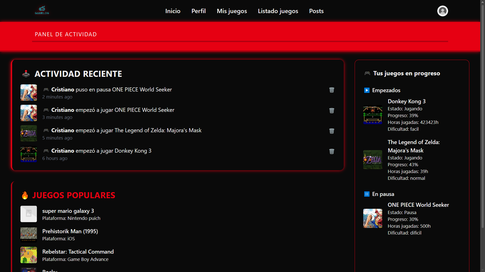  
Pantalla principal donde se muestra la actividad reciente, juegos populares y el estado de los juegos empezados o en pausa.

---

### 2. Añadir juego — búsqueda
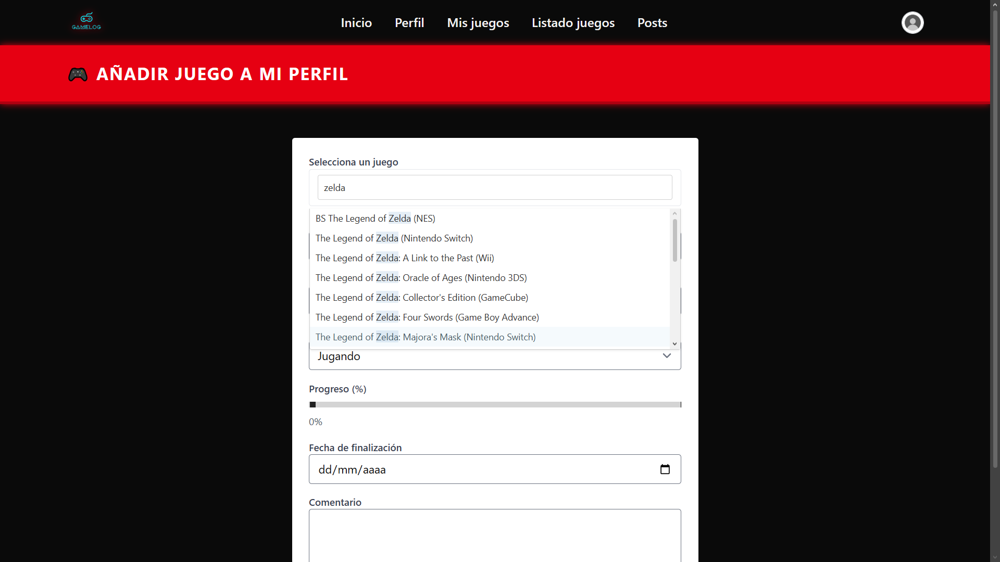  
Pantalla de búsqueda para añadir nuevos juegos, en este caso buscando “Zelda”.

---

### 3. Juego con datos completos
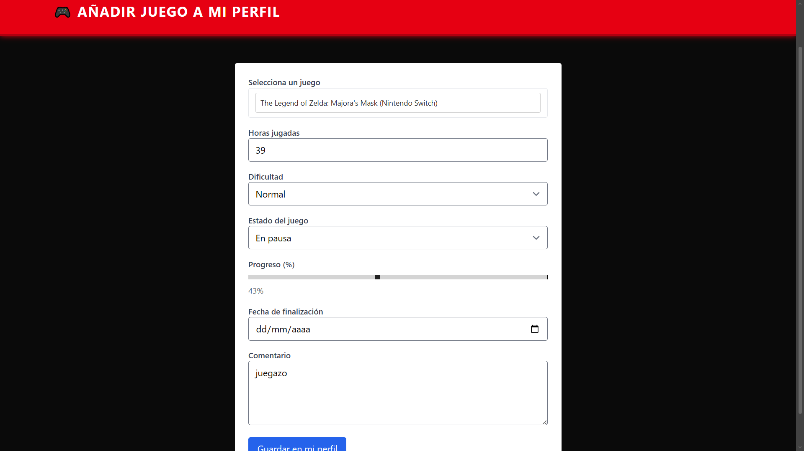  
Vista de un juego con toda su información rellenada: plataforma, progreso, notas y datos adicionales.

---

### 4. Mi lista de juegos
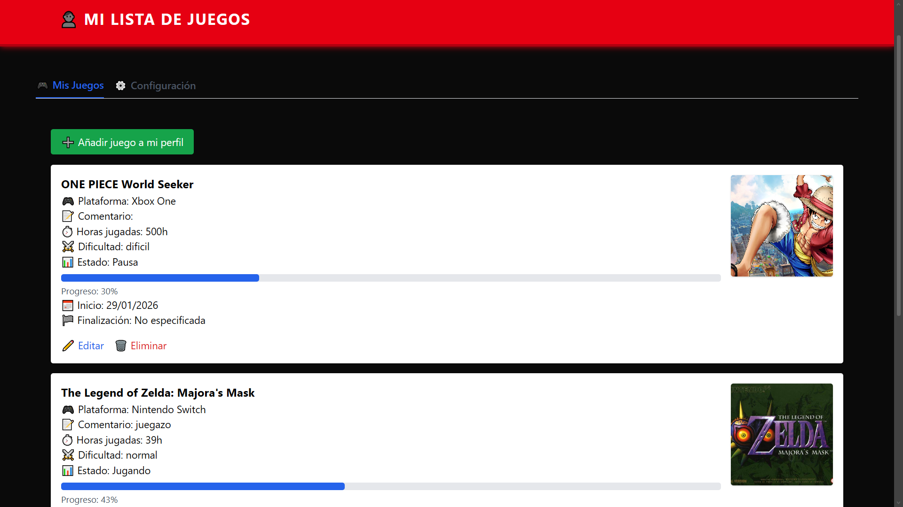  
Lista personal con todos los juegos añadidos, mostrando progreso, dificultad y acceso rápido para añadir más.

---

### 5. Editar juego
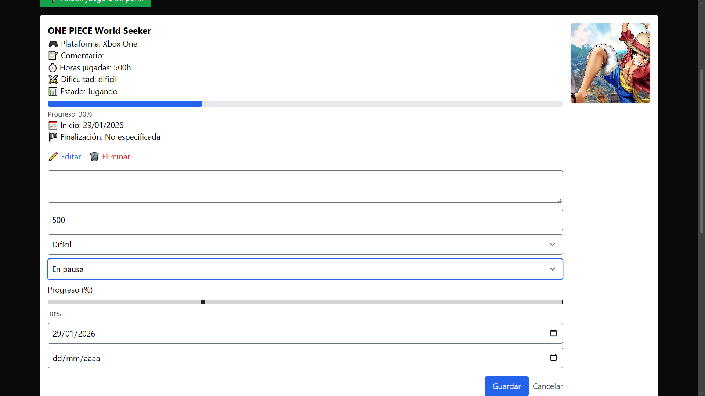  
Formulario para modificar la información de un juego ya añadido y actualizar su estado.

---

### 6. Biblioteca con filtros
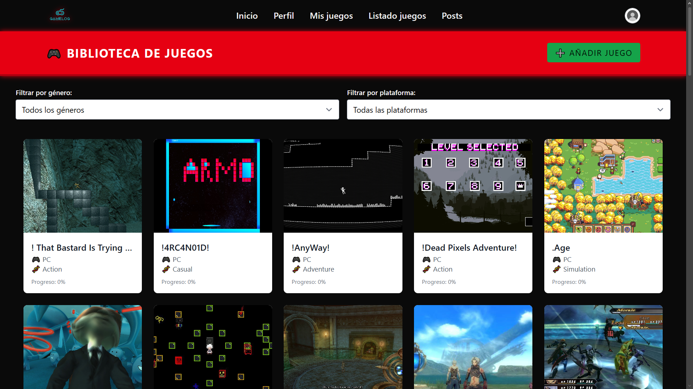  
Biblioteca general con filtros por género y consola para encontrar juegos fácilmente.

---

### 7. Ejemplo de filtrado
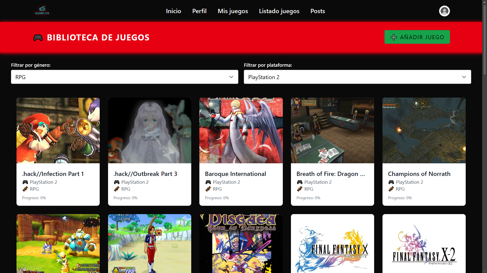  
Ejemplo de resultados tras aplicar filtros por plataforma o género.

---

### 8. Combinación de filtros
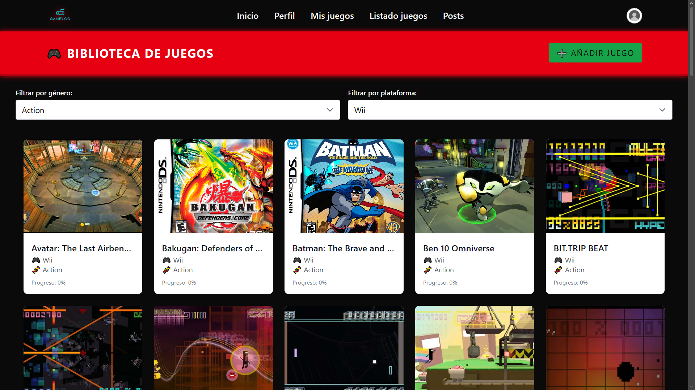  
Ejemplo usando varios filtros al mismo tiempo para afinar la búsqueda.

---

### 9. Panel superior y accesibilidad
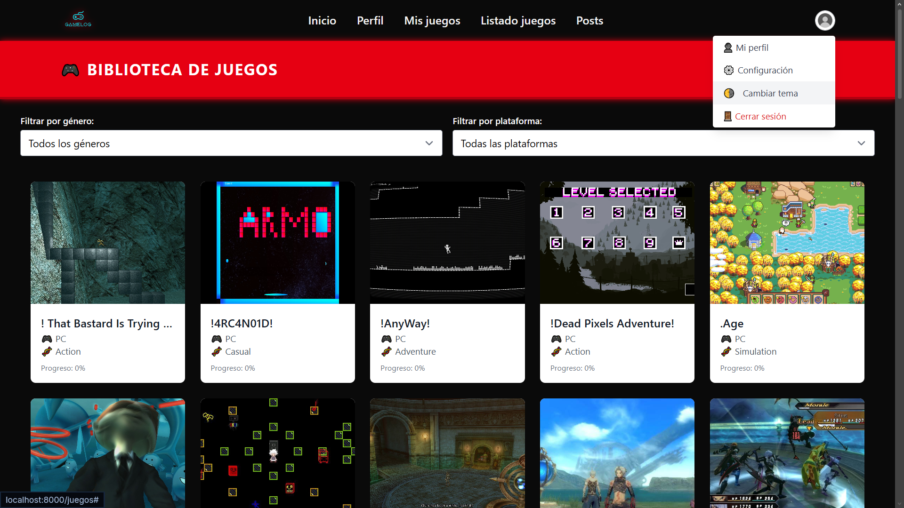  
Barra superior con opciones de accesibilidad, como el cambio de contraste.

---

### 10. Perfil personal
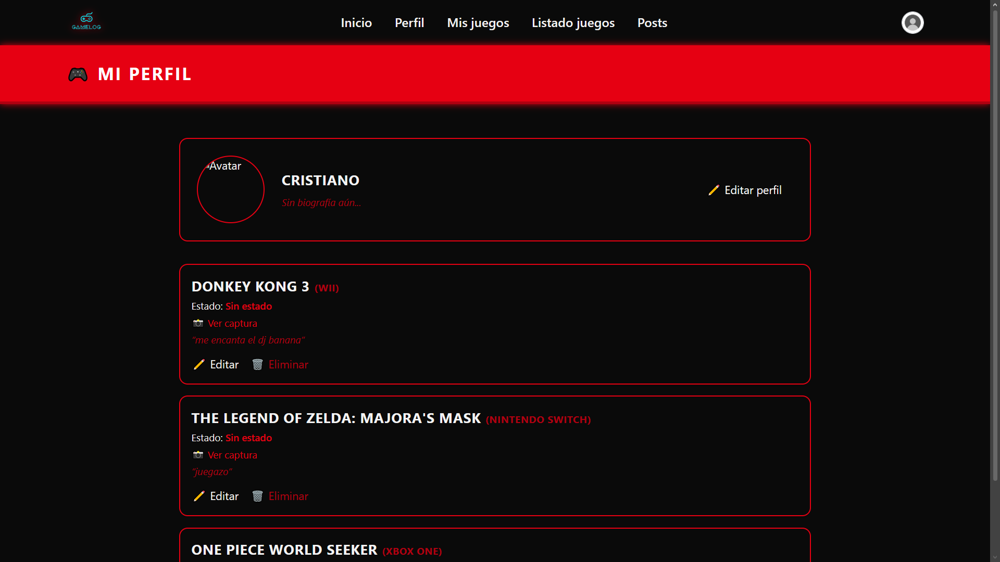  
Página de perfil con estadísticas, avatar y configuración del usuario.

---

### 11. Inicio con tema alternativo
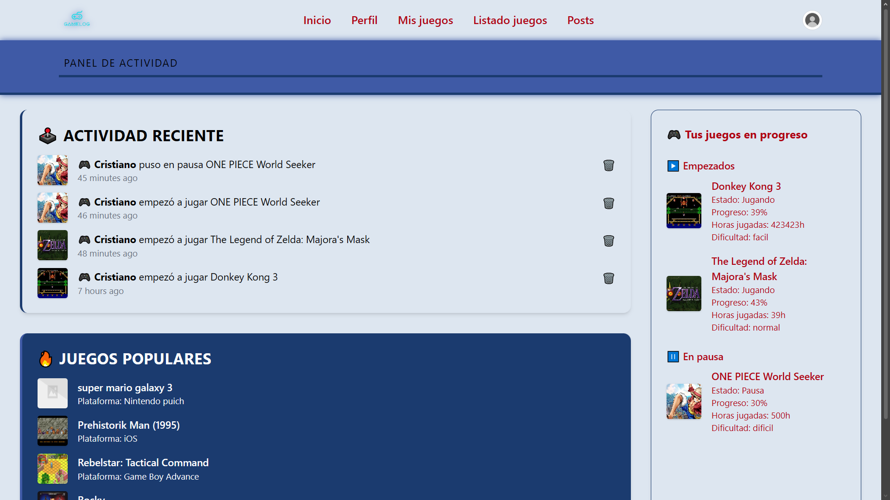  
Ejemplo de la página principal usando un esquema de colores diferente.

---

### Logotipo del proyecto
  
Logotipo utilizado en la cabecera y como icono del proyecto.
## 🚀 Instalación

```bash
git clone https://github.com/TU_USUARIO/mi-perfil-gamer.git
cd mi-perfil-gamer
composer install
npm install
npm run dev
cp .env.example .env
php artisan key:generate
php artisan migrate
php artisan serve
```

---

## 📌 Roadmap (ideas futuras)

- 🎖️ Sistema de logros por juego  
- 📊 Estadísticas del usuario  
- 🏆 Ranking de juegos completados  
- 🔗 Integración con APIs externas (IGDB, RAWG)  
- 🖼️ Subida real de capturas de pantalla  
- 👥 Perfiles públicos y amigos  

---

## 📄 Licencia
Este proyecto es de uso personal. Puedes adaptarlo o expandirlo libremente.

